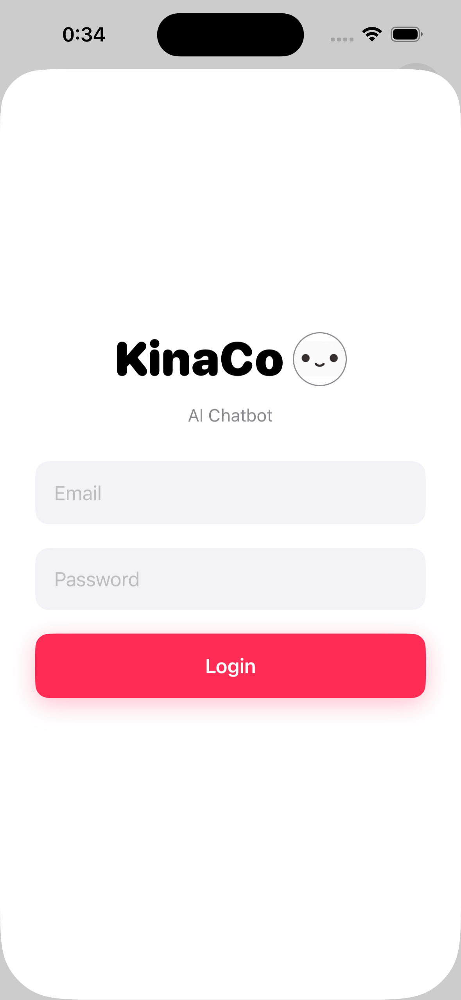
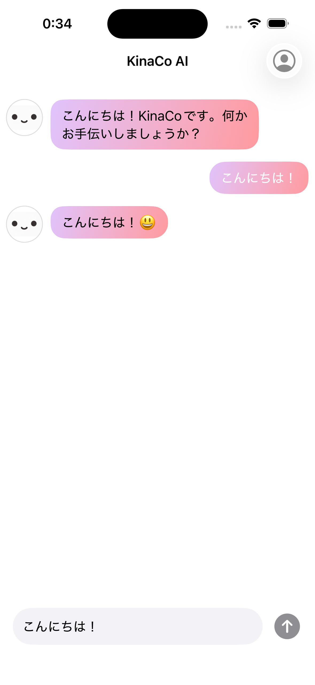

<div align>
  
# `KinaCo (きなこ)`
<p align="center">
  <kbd>AWS Cognito</kbd> ; <kbd>SwiftUI</kbd> ; <kbd>AI Logic</kbd>
</p>

---
</div>

## 📸 App Flow
<table>
  <tr>
    <td align="center"><b>1. Secure Login</b></td>
    <td align="center"><b>2. AI Chat Interface</b></td>
    <td align="center"><b>3. Seamless Interaction</b></td>
  </tr>
  <tr>
    <td></td>
    <td></td>
    <td></td>
  </tr>
</table>

</div>

## 🔗 Overview
KinaCo は、AIチャットアプリです。AWS Cognitoによる認証と、AWS Lambdaを介したAIチャットロジックを統合しています。

## 🛠️ Tech Stack & Security
* **Auth**: `AWS_COGNITO_IDP` (USER_PASSWORD_AUTH)
* **Core**: `SwiftUI` + `Combine` (@Observable)
* **API**: `REST_API_GATEWAY` / `LAMBDA_EXECUTOR`

## 📂 Project Structure
```
.
KinaCo/
├── Models/          # データ構造 (Message.swift など)
├── ViewModels/      # ビジネスロジック (AppViewModel.swift など)
├── Views/           # UIコンポーネント (LoginView, ChatView など)
├── Managers/        # 外部サービス連携 (AuthManager.swift など)
└── Networking/      # API通信クラス (KinaCoAPI.swift)

